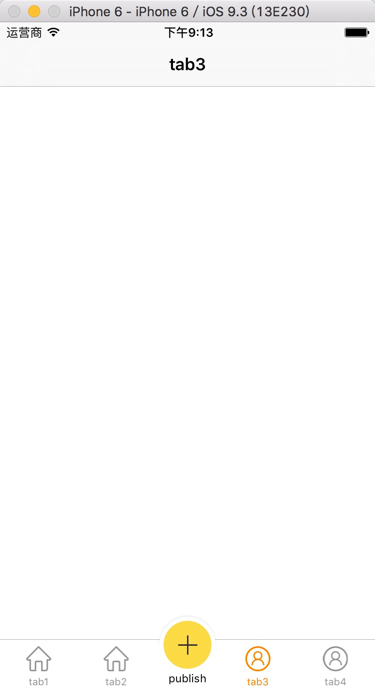

# WSTabBarController
A custom TabBarController with publish button written in Swift.




## Requirements
- iOS 8.0+
- Swift 2.2

## Installation


```
pod "WSTabBarController"
```

## Usage

```
import WSTabBarController

tabbarController = WSTabBarController(publishButtonConfig: {b in

            	//set your publish button like size,image,etc.
            }, publishButtonClick: { b in 
            
            	print("publish button clicked")
            })

```

Then use it just like a UITabBarController.


For the usage, please refer to Sample Project.


Enjoy! :)


## Author

Chisj, chisj2012@gmail.com
## License

WSTabBarController is available under the MIT license. See the LICENSE file for more info.