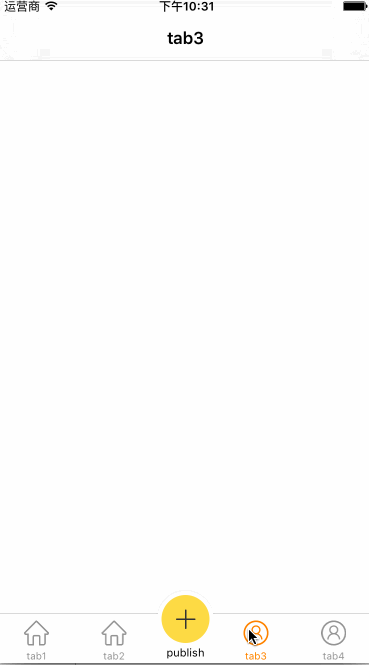
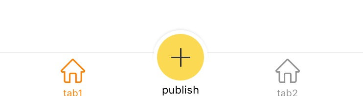
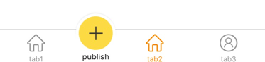
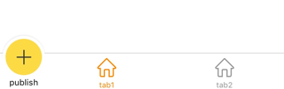

#WSTabBarController

[](https://raw.githubusercontent.com/chisj/WSTabBarController/master/LICENSE)&nbsp;
[](http://cocoapods.org/?q= WSTabBarController)&nbsp;
[](http://cocoapods.org/?q= WSTabBarController)&nbsp;
[](https://www.apple.com/nl/ios/)&nbsp;


A custom TabBarController with publish button written in Swift.



Two tabs



Three tabs



## Requirements

- iOS 8.0+
- Swift 2.2 (v0.0.3)
- Swift 3.0 (V0.0.4)

## Installation


```
pod "WSTabBarController"
```

## Usage

```
import WSTabBarController

tabbarController = WSTabBarController(publishButtonConfig: {b in

            	//set your publish button like size,image,etc.
            }, publishButtonClick: { b in 
            
            	print("publish button clicked")
            })

```

Then use it just like a UITabBarController.

### Custom publish button index





```
maintabbarController = WSTabBarController(publishButtonConfig: {b in

            	//set your publish button like size,image,etc.
            }, publishButtonClick: { b in 
            	print("publish button clicked")
            }, publishButtonIndex: 0)
```


For the usage, please refer to Sample Project.


Enjoy! :)


## Author

Chisj, chisj2012@gmail.com
## License

WSTabBarController is available under the MIT license. See the LICENSE file for more info.
